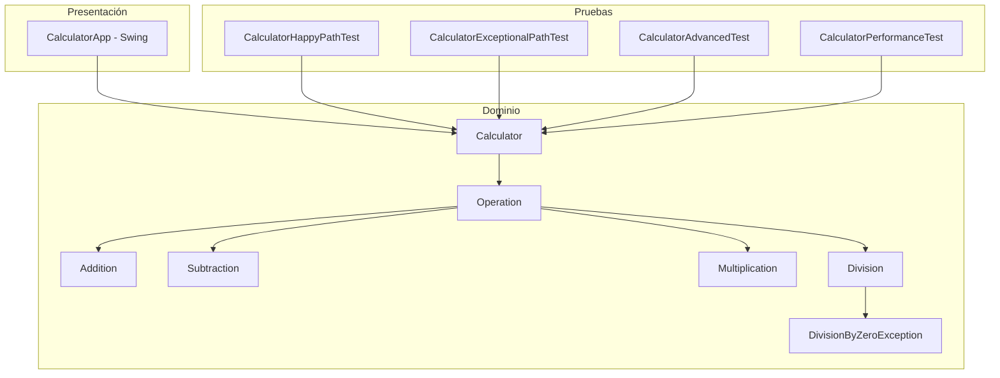

# Calculadora Graydoll

Calculadora en Java construida con Gradle como actividad de **Calidad de Software**. Soporta suma, resta, multiplicación y división, con pruebas unitarias (happy path, exceptional path, avanzadas y de performance) e interfaz gráfica.

## Integrantes

- Manuel Felipe Alvarez Rua
- Carlos Andrey Henao Rincón

## Arquitectura

El diseño separa la **fachada**, las **operaciones** y la **interfaz**. `Calculator` no calcula: delega en implementaciones de `Operation` (Strategy + inversión de dependencias). La GUI (`CalculatorApp`) y las pruebas usan esa misma fachada.



| Capa | Clases | Responsabilidad |
| --- | --- | --- |
| Presentación | `CalculatorApp` | Ventana Swing; no contiene la lógica aritmética |
| Fachada | `Calculator` | Expone `add`, `subtract`, `multiply`, `divide` |
| Contrato | `Operation` | Operación binaria `apply(left, right)` |
| Operaciones | `Addition`, `Subtraction`, `Multiplication`, `Division` | Una responsabilidad cada una |
| Error | `DivisionByZeroException` | Fallo controlado al dividir por cero |

Principios aplicados: SRP, OCP, DIP y patrón Strategy. Las operaciones se pueden inyectar en el constructor de `Calculator` (útil en pruebas con dobles).

## Herramientas y tecnologías

| Tecnología | Uso |
| --- | --- |
| Java 17 | Lenguaje y bytecode |
| Gradle 8.11.1 | Compilación, tests y ejecución (`gradlew`) |
| JUnit 5 (Jupiter 5.11.4) | Pruebas unitarias |
| Swing | Interfaz gráfica |
| Git / GitHub | Control de versiones |

## Cómo correr el proyecto

Requisito: **JDK 17** o superior. No hace falta instalar Gradle: se usa el wrapper.

En PowerShell, desde la raíz del repositorio:

```powershell
cd "ruta\del\proyecto"
```

**Ejecutar las pruebas** (equivalente a `mvn test`):

```powershell
.\gradlew.bat test --console=plain
```

El resumen aparece en consola. El reporte HTML queda en:

`build/reports/tests/test/index.html`

**Abrir la interfaz gráfica:**

```powershell
.\gradlew.bat run
```

Se abre la ventana *Calculadora Graydoll*. La GUI usa la misma clase `Calculator` que las pruebas.

Linux / macOS:

```bash
./gradlew test --console=plain
./gradlew run
```

## Resultados de las pruebas

Última ejecución con Gradle 8.11.1. El informe HTML de Gradle está en [`docs/test-report/index.html`](docs/test-report/index.html) (se regenera en `build/reports/tests/test/index.html` al correr `.\gradlew.bat test`).

| Métrica | Valor |
| --- | --- |
| Tests ejecutados | 34 |
| Fallos | 0 |
| Omitidos | 0 |
| Éxito | 100% |

| Clase | Tests | Qué cubre |
| --- | --- | --- |
| `CalculatorHappyPathTest` | 8 | Camino feliz (entradas válidas, patrón AAA) |
| `CalculatorExceptionalPathTest` | 3 | División por cero (`0`, `-0.0`, `0/0`) |
| `CalculatorAdvancedTest` | 21 | `@Nested`, `@ParameterizedTest`, contrato Liskov, inyección de dependencias |
| `CalculatorPerformanceTest` | 2 | Tiempo acotado (`@Timeout` y `assertTimeout`) |

Detalle por clase anidada de las pruebas avanzadas: Addition 5, Subtraction 4, Multiplication 4, Division 5, contrato Operation 2, inyección de dependencias 1.
